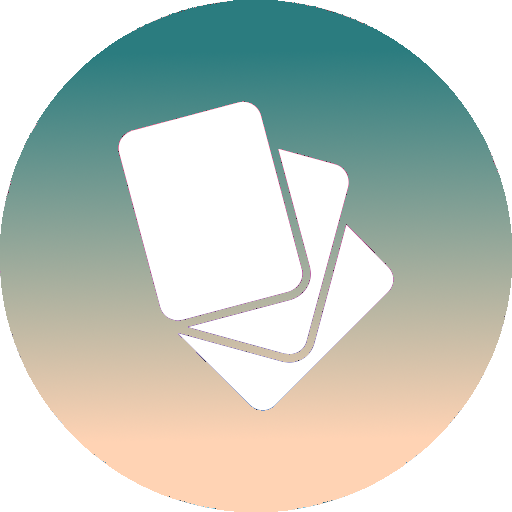
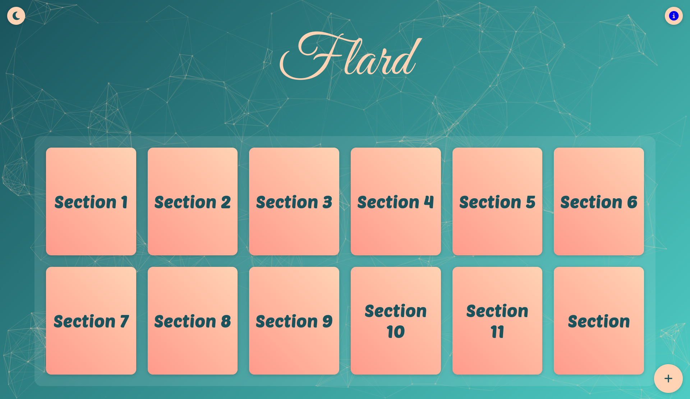

</img>
<h1 style="font-family: 'Great Vibes'; font-size: 13rem; color: #FFD3B4; text-align: center;">Flard</h1>

<h2 style="font-family: 'Arial', sans-serif; text-align: center;">Flard is a modern and visually appealing flashcard application built with HTML, CSS, and JavaScript. It provides users with an interactive and engaging platform to create, manage, and study flashcards efficiently. 🌟📖</h2>
</img>

## Features 🚀

- **Responsive Design:** The application is designed to be responsive and mobile-friendly, ensuring an optimal viewing experience across various devices.
- **User-Friendly Interface:** 😊 Flard offers an intuitive and visually appealing user interface, making it easy for users to navigate and interact with the application.
- **Flashcard Creation:** Users can create unlimited flashcards by clicking on the "+" button. Each flashcard consists of a front side for the question and a back side for the answer.
- **Rich Text Editing:** The application utilizes the Quill editor, allowing users to format their questions and answers with various text styles, including bold, italics, and code blocks.
- **Theme Switching:** Users can switch between light and dark themes with a single click, providing a personalized and visually appealing experience.
- **Particle Background:** A stunning particle background effect adds an engaging and visually appealing touch to the application.
- **Flashcard Management:** Users can easily edit, save, and delete flashcards within the application.
- **Seamless Navigation:** Flard provides a smooth and intuitive navigation experience, allowing users to effortlessly switch between flashcards and manage their collections.

## Acknowledgments 🙏

- [Font Awesome](https://fontawesome.com/) for the beautiful icons used in the application.
- [Quill](https://quilljs.com/) for the powerful rich text editor.
- [Particles.js](https://vincentgarreau.com/particles.js/) for the stunning particle background effect.

## Demo
You can check out a live demo of Flard [here](https://youssuf.tech/Flard).